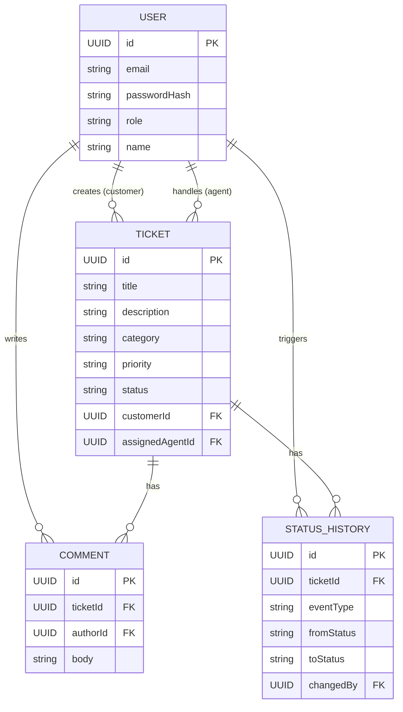
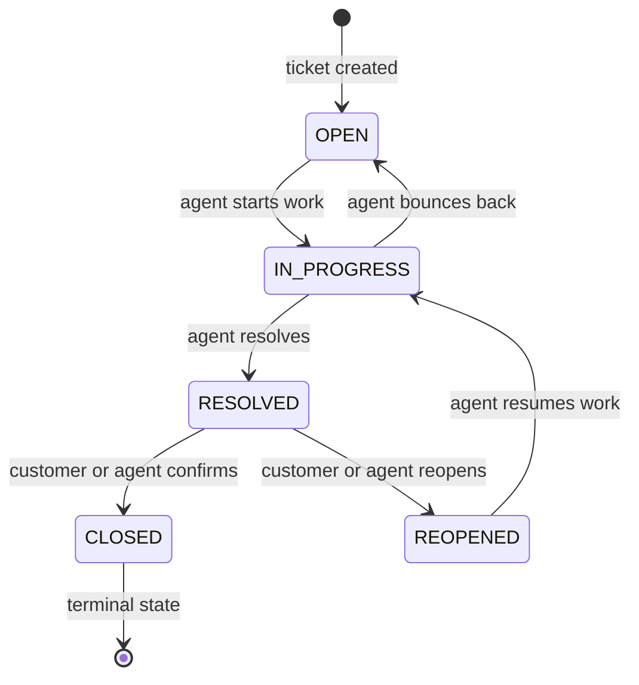

# Data Model

## Entities

### `User`
| Field | Type | Notes |
|---|---|---|
| id | UUID (PK) | |
| email | String | unique, used as login |
| passwordHash | String | BCrypt |
| role | Enum (`CUSTOMER`, `AGENT`) | |
| name | String | |
| createdAt | Instant | |

### `Ticket`
| Field | Type | Notes |
|---|---|---|
| id | UUID (PK) | |
| title | String | |
| description | Text | |
| category | Enum | `TECHNICAL`, `BILLING`, `ACCOUNT`, `GENERAL` |
| priority | Enum | `LOW`, `MEDIUM`, `HIGH`, `URGENT`; default `MEDIUM` |
| status | Enum | `OPEN`, `IN_PROGRESS`, `RESOLVED`, `CLOSED`, `REOPENED` |
| customerId | UUID (FK → User) | required |
| assignedAgentId | UUID (FK → User, nullable) | |
| createdAt | Instant | |
| updatedAt | Instant | |

### `Comment`
| Field | Type | Notes |
|---|---|---|
| id | UUID (PK) | |
| ticketId | UUID (FK → Ticket) | |
| authorId | UUID (FK → User) | |
| body | Text | |
| createdAt | Instant | |

### `StatusHistory`
| Field | Type | Notes |
|---|---|---|
| id | UUID (PK) | |
| ticketId | UUID (FK → Ticket) | |
| eventType | Enum | `STATUS_CHANGE`, `ASSIGNMENT` — see note below |
| fromStatus | Enum, nullable | null on ticket creation event |
| toStatus | Enum, nullable | null on assignment-only events; see note |
| fromAgentId | UUID, nullable | populated for `ASSIGNMENT` events |
| toAgentId | UUID, nullable | populated for `ASSIGNMENT` events |
| changedBy | UUID (FK → User) | |
| changedAt | Instant | |
| note | String, nullable | |

> **Why `eventType` exists**: TASK-005 (US-002) requires assignment changes
> to be tracked, and TASK-012 requires status changes to be tracked. Rather
> than force both into a "status history" table with awkward nulls
> everywhere, `eventType` disambiguates the two kinds of event in one
> append-only audit table. This keeps `GET /api/tickets/{id}/history` as a
> single endpoint returning a unified timeline, which is a better user
> story ("show me everything that happened to this ticket") than two
> separate endpoints. Document this modeling choice — it's a reasonable
> interpretation of TASK-012 but goes slightly beyond the literal words
> "status history," so call it out in the README assumptions section.

## Relationships

```
User (1) ──< (many) Ticket [as customer]
User (1) ──< (many) Ticket [as assignedAgent, nullable]
Ticket (1) ──< (many) Comment
Ticket (1) ──< (many) StatusHistory
User (1) ──< (many) Comment [as author]
User (1) ──< (many) StatusHistory [as changedBy]
```

## ERD (text form — render as an actual diagram in the README if time
permits, e.g. via Mermaid)



## Status transition state diagram (authoritative — mirrors
`01-REQUIREMENTS.md` TASK-010 table exactly; if these two ever disagree,
that's a bug, fix both together)



## Indexes

- `ticket.customer_id` — customers listing their own tickets.
- `ticket.assigned_agent_id` — agents listing tickets assigned to them
  (this is literally US-002's premise, "tickets assigned to me" — this
  index is not optional, it's the primary access pattern for that story).
- `ticket.status` — supports the `?status=` filter on `GET /api/tickets`
  (`04-API-SPEC.md`); a composite index on `(assigned_agent_id, status)`
  covers the agent's filtered-list query in one lookup.
- `status_history.ticket_id` — fetching a ticket's history.
- `comment.ticket_id` — fetching a ticket's comments.
- `user.email` — unique index, doubles as the login lookup index.

## Migrations

Use Flyway (`spring-boot-starter-flyway` or the `flyway-core` dependency).
Migration files live in `src/main/resources/db/migration/`, named
`V1__init_schema.sql`, `V2__seed_data.sql` (optional, for demo users), etc.
Do not use `hibernate.ddl-auto=update` for anything beyond local
throwaway testing — for a submission that needs a reproducible DB backup,
migrations are the correct mechanism, not Hibernate auto-DDL.
