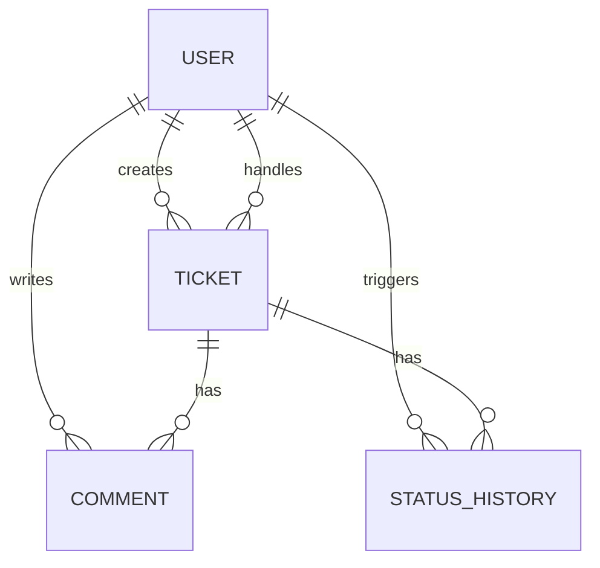
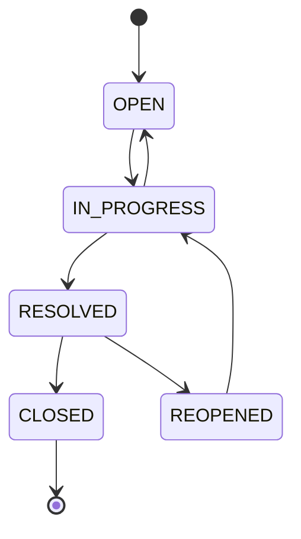

# Customer Support Ticketing System

A Spring Boot REST API for creating, discovering, assigning, and managing support tickets, with ownership-based authorization, enforced status transitions, comments, and an append-only audit history.

## Tech Stack

- Java 21 and Spring Boot 3.5.5 (Web, Data JPA, Security, Validation, Actuator)
- PostgreSQL 16 and Flyway migrations
- HMAC-signed JWT, a bounded principal cache, and BCrypt password hashing
- JUnit 5, Mockito, H2, Testcontainers PostgreSQL, and JaCoCo
- Docker and Docker Compose

## Quick Start (Docker - recommended)

macOS/Linux:

```bash
git clone https://github.com/eslamabdullatif21-ai/Aldaleel-Raqamee-Task.git
cd Aldaleel-Raqamee-Task
cp .env.example .env
# Edit .env and replace DB_PASSWORD and JWT_SECRET.
docker compose up --build --wait
```

Windows PowerShell:

```powershell
git clone https://github.com/eslamabdullatif21-ai/Aldaleel-Raqamee-Task.git
Set-Location Aldaleel-Raqamee-Task
Copy-Item .env.example .env
notepad .env
# Replace DB_PASSWORD and JWT_SECRET, save the file, then run:
docker compose up --build --wait
```

The API is available at `http://localhost:8080`; health is available at
`http://localhost:8080/actuator/health`. Compose refuses to start when either
required secret is missing. PostgreSQL is intentionally available only to the
internal Compose network. Flyway creates the schema automatically. The image
build runs the unit suite before packaging, so this standalone Docker workflow
does not depend on GitHub Actions for verification.

## Quick Start (local)

Prerequisites: JDK 21, Maven 3.9+, and PostgreSQL 16.

```bash
# Create database support_ticketing and user app, then set:
export SPRING_DATASOURCE_URL=jdbc:postgresql://localhost:5432/support_ticketing
export SPRING_DATASOURCE_USERNAME=app
export SPRING_DATASOURCE_PASSWORD=your-password
export JWT_SECRET=a-random-secret-containing-at-least-32-bytes
# Optional: defaults shown
export LOGIN_RATE_LIMIT_MAX_ATTEMPTS=10
export LOGIN_RATE_LIMIT_WINDOW=PT1M
export JWT_USER_CACHE_TTL=PT1M
export VIRTUAL_THREADS_ENABLED=true
export JAVA_TOOL_OPTIONS="-Xms1g -Xmx2g"
mvn spring-boot:run
```

PowerShell uses `$env:VARIABLE_NAME='value'` instead of `export`.

## Restoring the Database Backup

A PostgreSQL 16.9 schema-and-data dump generated with `pg_dump` is included at `db/backup.sql`. It contains the Flyway schema history and demo data. Its verified SHA-256 is `49C7490576A3F9707D68CEF67CD92DB6D7FBCAE0FA2D8712701F58E1EB4F5BEA`.

> **Destructive restore warning:** `db/backup.sql` starts with `DROP` statements.
> Restoring it replaces the application tables and their data. Use a new or
> intentionally disposable database, and back up any data you need first.

```bash
docker compose up -d --wait postgres
docker compose stop app
docker compose exec -T postgres psql -v ON_ERROR_STOP=1 -U app -d support_ticketing < db/backup.sql
docker compose up -d --build --wait app
```

When running from PowerShell, use
`cmd /c "docker compose exec -T postgres psql -v ON_ERROR_STOP=1 -U app -d support_ticketing < db\backup.sql"`
for the restore command because PowerShell does not support Bash-style input
redirection.

Demo accounts included in the dump:

| Role | Email | Password |
|---|---|---|
| Customer | `customer@example.com` | `Customer123!` |
| Agent 1 | `agent@example.com` | `Agent123!` |
| Agent 2 | `agent2@example.com` | `Agent123!` |

The dump contains 3 users (including 2 agents), 2 tickets, 3 comments, and 7 history events.

## Running Tests

```bash
mvn test
```

The unit suite has 114 tests. Mockito is configured as a Java agent, so the suite
runs in an ordinary Java 21 Maven container without privileged mode or extra
Linux capabilities:

```bash
docker run --rm -v "$PWD:/workspace" -w /workspace \
  maven:3.9.9-eclipse-temurin-21-alpine mvn test
```

Windows PowerShell uses the same command with `${PWD}`:

```powershell
docker run --rm -v "${PWD}:/workspace" -w /workspace `
  maven:3.9.9-eclipse-temurin-21-alpine mvn test
```

JaCoCo output is generated at `target/site/jacoco/index.html`. The suite focuses
on transitions, permissions, unassigned discovery, idempotent assignment,
service orchestration, pagination, authentication, JWT caching, safe errors,
allowed sorting, and throttling.

PostgreSQL integration tests use Testcontainers and run separately so the unit
suite remains fast. Docker must be running:

```bash
mvn verify -Pintegration
```

Docker Engine 29 and later may reject docker-java's legacy discovery request.
If the test reports `client version 1.32 is too old`, use the server's minimum
API version (the CI workflow detects this automatically):

```bash
mvn verify -Pintegration -Dapi.version=1.44
```

The integration profile proves that Flyway and Hibernate validate a clean
PostgreSQL 16 database and that ticket creation, unassigned discovery,
idempotent assignment, permissions, valid/invalid transitions, and history
writes behave atomically on PostgreSQL.

For the retained aggressive k6 boundary test, start the API and run:

```powershell
k6 run -e VUS=1000 -e DURATION=10s -e THINK_SECONDS=1 review/k6-boundary.js
```

This profile activates every VU immediately, so it intentionally tests connection
storm and saturation behavior. The latest run used a containerized k6 generator
on the same Docker network as the Java 21 application:

| VUs | Requests | Failed | Requests/second | Successful p95 |
|---:|---:|---:|---:|---:|
| 1,000 | 10,001 | 0% | 951 | 118.51 ms |
| 5,000 | 47,765 | 0% | 4,318 | 519.4 ms |
| 10,000 | 18,917 | 33.96% | 1,238 | 6.3 s |

The 10,000-VU tier saturated and timed out requests, although the application
remained running with no restart or OOM and recovered immediately. The former
gentle profile ramped users and used a ten-second think time, producing about one
tenth of the pressure and zero failures; it measured mostly-idle concurrent users
rather than the same workload. These same-host results are comparative evidence,
not production capacity figures; use a separate load generator for sizing.

## Single-Instance Performance Profile

The defaults are intentionally bounded and environment-configurable:

| Setting | Default | Purpose |
|---|---:|---|
| JWT principal cache | 1 minute | Avoid a PostgreSQL user lookup on every authenticated request |
| Hikari pool | 16 fixed connections | Bound database concurrency and keep connections ready |
| Tomcat max connections / accept queue | 12,000 / 2,000 | Absorb connection bursts before refusing sockets |
| Java 21 virtual threads | Enabled | Reduce the cost of blocking request concurrency |
| JVM heap | 1-2 GiB in Compose/example environment | Make memory capacity explicit |

`JwtAuthenticationFilter` verifies each JWT once. The signed token carries user
ID, email, and role, while the local cache carries a password-free snapshot of
the current user. Normal password login still queries PostgreSQL and checks the
current BCrypt hash. User deletion, email changes, and role changes can remain
cached for at most `JWT_USER_CACHE_TTL`; after refresh, an old token whose signed
claims no longer match is rejected and the user must log in again. Set a shorter
TTL for faster revocation at the cost of more database reads. Tokens issued by
older builds do not contain the required user ID claim and require one re-login.

## API Documentation

All endpoints except registration, login, and `/actuator/health` require
`Authorization: Bearer <token>`.

| Method | Path | Purpose |
|---|---|---|
| POST | `/api/auth/register` | Register a customer account |
| POST | `/api/auth/login` | Receive a JWT |
| POST | `/api/tickets` | Create a customer ticket |
| GET | `/api/tickets` | Paginated, role-scoped list with filters and allow-listed sorting |
| GET | `/api/tickets/unassigned` | Agent-only paginated queue of unassigned tickets |
| GET | `/api/tickets/{id}` | View an accessible ticket |
| PATCH | `/api/tickets/{id}/assign` | Self-claim or reassign; repeated same-agent requests are no-ops |
| PATCH | `/api/tickets/{id}/status` | Apply a valid status transition |
| PATCH | `/api/tickets/{id}/priority` | Change priority |
| POST/GET | `/api/tickets/{id}/comments` | Add/list paginated immutable comments |
| GET | `/api/tickets/{id}/history` | Paginated creation, assignment, and status events |

## Architecture and Design Patterns

Controllers only handle HTTP mapping; services own transactions and orchestration; repositories isolate JPA; DTOs prevent persistence entities leaking over the wire. `TicketStateMachine` is the one transition-rule source. `PermissionService` is a deliberately small strategy-style policy component rather than a class hierarchy. A manual mapper keeps the mapping dependency surface small, and `@RestControllerAdvice` guarantees one error format.

CQRS, event sourcing, microservices, and a custom repository abstraction were intentionally excluded: this is one small bounded context, and each would add complexity without solving a requirement. History is an append-only audit log; current ticket state is not reconstructed from events.





## Task Traceability

| Task | Implementation |
|---|---|
| TASK-001 Ticket model | `domain/entity/Ticket.java` |
| TASK-002 Create API | `TicketController#create`, `TicketService#create` |
| TASK-003 Category | `domain/enums/TicketCategory.java` |
| TASK-004 Priority | `domain/enums/TicketPriority.java` |
| TASK-005 (US-001) Validation | `dto/request/CreateTicketRequest.java`, `GlobalExceptionHandler` |
| TASK-005 (US-002) Assignment | `TicketController#assign`, `TicketService#assign` |
| TASK-006 Status update | `TicketController#status`, `TicketService#updateStatus` |
| TASK-007 Priority update | `TicketController#priority`, `TicketService#updatePriority` |
| TASK-008 Comments | `CommentController`, `TicketService#addComment/comments` |
| TASK-009 Permissions | `security/PermissionService.java`, method security |
| TASK-010 Allowed transitions | `domain/statemachine/TicketStateMachine.java` |
| TASK-011 Invalid-transition prevention | `TicketStateMachine#validateTransition`, HTTP 409 handler |
| TASK-012 Status history | `domain/entity/StatusHistory.java`, `StatusHistoryAppender`, `TicketService#history` |
| Agent discovery enhancement | `TicketController#unassigned`, `TicketService#unassigned` |

## Assumptions, Decisions, and Tradeoffs

Key choices are:

- Omitted priority defaults to `MEDIUM`; tickets start `OPEN` and unassigned.
- Agents can discover unassigned tickets through an agent-only queue. An agent
  may self-claim one; only its current agent may reassign it.
- Repeating an assignment to the current agent is an idempotent no-op and does
  not create misleading history.
- The customer may close or reopen their own resolved ticket; all other customer status changes are forbidden.
- Public registration accepts customer accounts only; the backup provides the demo agent.
- Status, creation, and assignment events form one immutable chronological timeline.
- JWT user caching and login throttling are deliberately single-instance mechanisms.

## Bonuses Implemented

- Database: PostgreSQL with Flyway and `db/backup.sql`.
- Docker: multi-stage non-root image plus app/database Compose stack.
- Tests: 114 unit tests, PostgreSQL Testcontainers integration tests, JaCoCo reporting, and GitHub Actions CI.

## Completion Status

All feature tasks TASK-001 through TASK-012 are implemented. The repository
contains reproducible Java 21 unit and PostgreSQL integration test commands, a
multi-stage non-root Docker image, a hardened Compose stack with health checks,
and a PostgreSQL 16.9 dump with documented credentials and checksum. The dump is
verified with a clean `psql -v ON_ERROR_STOP=1` restore before release.
