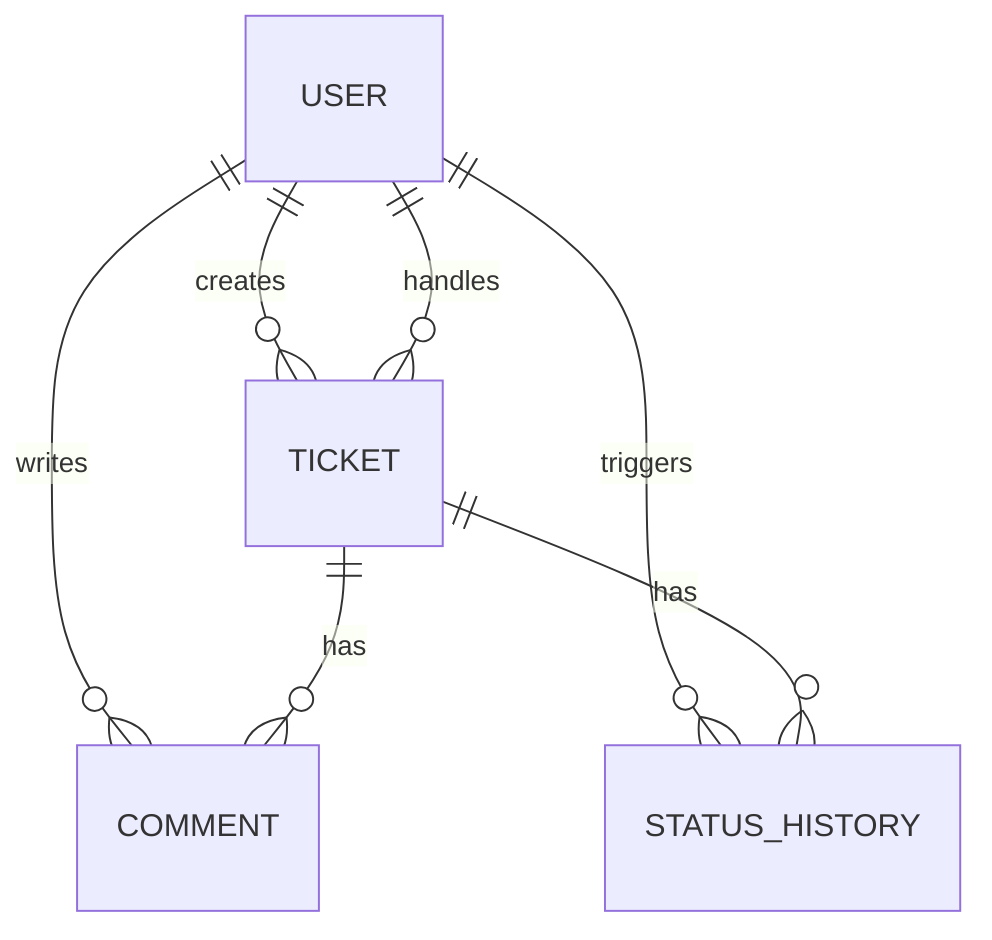
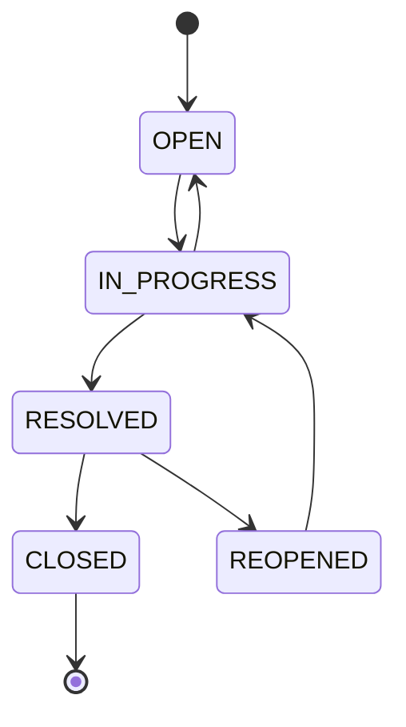

# Customer Support Ticketing System

A Spring Boot REST API for creating, assigning, and managing support tickets, with ownership-based authorization, enforced status transitions, comments, and an append-only audit history.

## Tech Stack

- Java 21 and Spring Boot 3.5.5 (Web, Data JPA, Security, Validation)
- PostgreSQL 16 and Flyway migrations
- JWT (HS256) and BCrypt password hashing
- JUnit 5, Mockito, H2 test profile, and JaCoCo
- Docker and Docker Compose

## Quick Start (Docker - recommended)

```bash
git clone <repository-url>
cd support-ticketing
copy .env.example .env   # Windows; use: cp .env.example .env on macOS/Linux
# Replace the example secrets in .env
docker compose up --build
```

The API is available at `http://localhost:8080`. Flyway creates the schema automatically. Docker image builds skip tests because the verified test phase is separate.

## Quick Start (local)

Prerequisites: JDK 21, Maven 3.9+, and PostgreSQL 16.

```bash
# Create database support_ticketing and user app, then set:
export SPRING_DATASOURCE_URL=jdbc:postgresql://localhost:5432/support_ticketing
export SPRING_DATASOURCE_USERNAME=app
export SPRING_DATASOURCE_PASSWORD=your-password
export JWT_SECRET=a-random-secret-containing-at-least-32-bytes
# Optional: defaults shown
export LOGIN_RATE_LIMIT_MAX_ATTEMPTS=10
export LOGIN_RATE_LIMIT_WINDOW=PT1M
mvn spring-boot:run
```

PowerShell uses `$env:VARIABLE_NAME='value'` instead of `export`.

## Restoring the Database Backup

A PostgreSQL 16.9 schema-and-data dump generated with `pg_dump` is included at `db/backup.sql`. It contains the Flyway schema history and demo data; see `db/BACKUP-MANIFEST.md` for verified counts and checksum.

```bash
docker compose exec -T postgres psql -U app -d support_ticketing < db/backup.sql
```

Demo accounts included in the dump:

| Role | Email | Password |
|---|---|---|
| Customer | `customer@example.com` | `Customer123!` |
| Agent | `agent@example.com` | `Agent123!` |

The dump contains 2 users, 2 tickets, 3 comments, and 7 history events. `db/seed-demo.ps1` reproduces the dataset through the public API on a fresh database.

## Running Tests

```bash
mvn test
```

The implemented suite has 47 passing tests. JaCoCo output is generated at `target/site/jacoco/index.html`; measured line coverage is 100% for `TicketStateMachine`, 81% for `PermissionService`, 100% for `JwtService`, 88% for `LoginRateLimiter`, and 66% for `TicketService`. The tests prioritize transition, permission, pagination, and throttling rules over trivial persistence plumbing.

For a full reviewer-style pass, start the API with its isolated test profile in one terminal and run the black-box harness in another:

```powershell
$env:SPRING_PROFILES_ACTIVE='test'
$env:JWT_SECRET='review-only-secret-key-containing-at-least-thirty-two-bytes'
mvn spring-boot:test-run

# Second terminal
powershell.exe -NoProfile -ExecutionPolicy Bypass -File review\e2e-review.ps1
```

The final review executed 64 live HTTP checks with 64 passes, including pagination, login throttling, Flyway migration, and Hibernate schema validation. See [the scored review report](review/REVIEW_REPORT.md).

For a bounded k6 concurrency run against a started application, use the reusable
review profile (30 VUs by default):

```powershell
k6 run -e VUS=1000 -e DURATION=10s review/k6-boundary.js
```

The 1,000/5,000/10,000-VU single-instance measurements and their limitations
are recorded in [the performance audit](audits/PERFORMANCE_AUDIT.md).

## API Documentation

The full contract is [04-API-SPEC.md](04-API-SPEC.md). All endpoints except registration and login require `Authorization: Bearer <token>`.

| Method | Path | Purpose |
|---|---|---|
| POST | `/api/auth/register` | Register a customer or agent |
| POST | `/api/auth/login` | Receive a JWT |
| POST | `/api/tickets` | Create a customer ticket |
| GET | `/api/tickets` | Paginated, role-scoped ticket list with filters |
| GET | `/api/tickets/{id}` | View an accessible ticket |
| PATCH | `/api/tickets/{id}/assign` | Assign or reassign to an agent |
| PATCH | `/api/tickets/{id}/status` | Apply a valid status transition |
| PATCH | `/api/tickets/{id}/priority` | Change priority |
| POST/GET | `/api/tickets/{id}/comments` | Add/list paginated immutable comments |
| GET | `/api/tickets/{id}/history` | Paginated creation, assignment, and status events |

## Architecture and Design Patterns

Controllers only handle HTTP mapping; services own transactions and orchestration; repositories isolate JPA; DTOs prevent persistence entities leaking over the wire. `TicketStateMachine` is the one transition-rule source. `PermissionService` is a deliberately small strategy-style policy component rather than a class hierarchy. A manual mapper keeps the mapping dependency surface small, and `@RestControllerAdvice` guarantees one error format.

CQRS, event sourcing, microservices, and a custom repository abstraction were intentionally excluded: this is one small bounded context, and each would add complexity without solving a requirement. History is an append-only audit log; current ticket state is not reconstructed from events.





## Task Traceability

| Task | Implementation |
|---|---|
| TASK-001 Ticket model | `domain/entity/Ticket.java` |
| TASK-002 Create API | `TicketController#create`, `TicketService#create` |
| TASK-003 Category | `domain/enums/TicketCategory.java` |
| TASK-004 Priority | `domain/enums/TicketPriority.java` |
| TASK-005 (US-001) Validation | `dto/request/CreateTicketRequest.java`, `GlobalExceptionHandler` |
| TASK-005 (US-002) Assignment | `TicketController#assign`, `TicketService#assign` |
| TASK-006 Status update | `TicketController#status`, `TicketService#updateStatus` |
| TASK-007 Priority update | `TicketController#priority`, `TicketService#updatePriority` |
| TASK-008 Comments | `CommentController`, `TicketService#addComment/comments` |
| TASK-009 Permissions | `security/PermissionService.java`, method security |
| TASK-010 Allowed transitions | `domain/statemachine/TicketStateMachine.java` |
| TASK-011 Invalid-transition prevention | `TicketStateMachine#validateTransition`, HTTP 409 handler |
| TASK-012 Status history | `domain/entity/StatusHistory.java`, `TicketService#history` |

## Assumptions and Decisions

- Omitted creation priority defaults to `MEDIUM`; status always starts at `OPEN` and assignment starts null.
- Any agent may claim or reassign a ticket. Status, priority, viewing, comments, and history then require that agent to be assigned.
- A customer may change their own `RESOLVED` ticket to `CLOSED` or `REOPENED`; all other customer status changes are forbidden.
- Registration accepts a role for assessment usability. Agent provisioning would be admin-controlled in production.
- JWTs expire after one hour by default. The signing secret must be at least 32 bytes and comes from the environment.
- Assignment and status events share one immutable timeline. Creation records `null -> OPEN`.
- Comment/history pages are capped at 100 records and always use stable chronological ordering.
- Login permits 10 attempts per observed client address per minute by default. This in-memory limiter is appropriate for a single instance; a trusted gateway or shared limiter is required when horizontally scaling.
- H2 is used only for lightweight test configuration; unit tests isolate domain logic with Mockito. Production remains PostgreSQL-only.

## Bonuses Implemented

- Database: PostgreSQL with Flyway and `db/backup.sql`.
- Docker: multi-stage non-root image plus app/database Compose stack.
- Unit tests: 47 tests with JaCoCo reporting.

## Audits

- [Code quality audit](audits/CODE_QUALITY_AUDIT.md): layering and single-source rules passed; test coverage is intentionally risk-weighted rather than uniform.
- [Security audit](audits/SECURITY_AUDIT.md): authorization, secret handling, and single-instance login rate limiting passed.
- [Performance audit](audits/PERFORMANCE_AUDIT.md): ticket, comment, and history listing are paginated and indexed.

## Incomplete / Deviated Requirements

All feature tasks TASK-001 through TASK-012 are implemented. PostgreSQL 16.9 was run locally: Flyway migrated an empty database, demo data was created through the API, `pg_dump` generated the backup, and that dump was restored into a second database where counts, Flyway validation, authentication, ticket listing, comments, and history were verified. Docker is not installed, so the Compose stack itself could only be statically checked. The installed JDK was Java 17, so the passing build used a temporary `-Djava.version=17` verification override while the committed project and Docker image remain targeted to Java 21.
